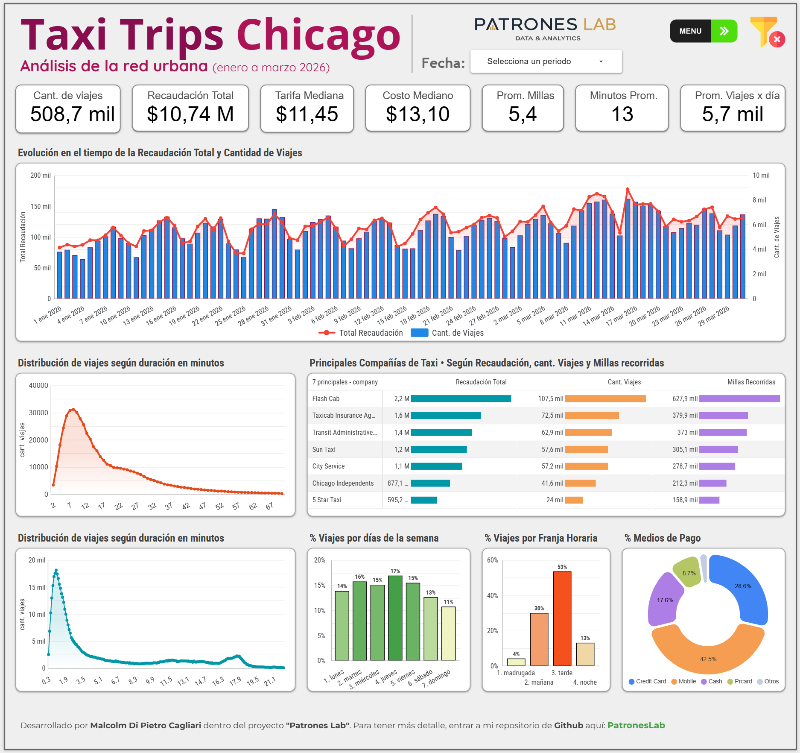
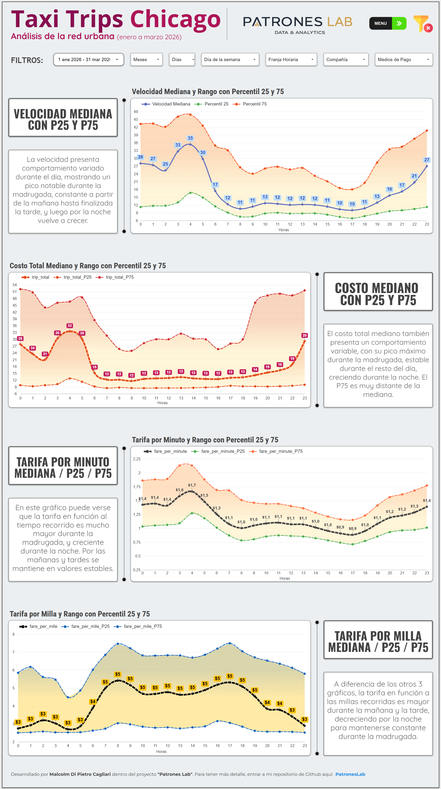
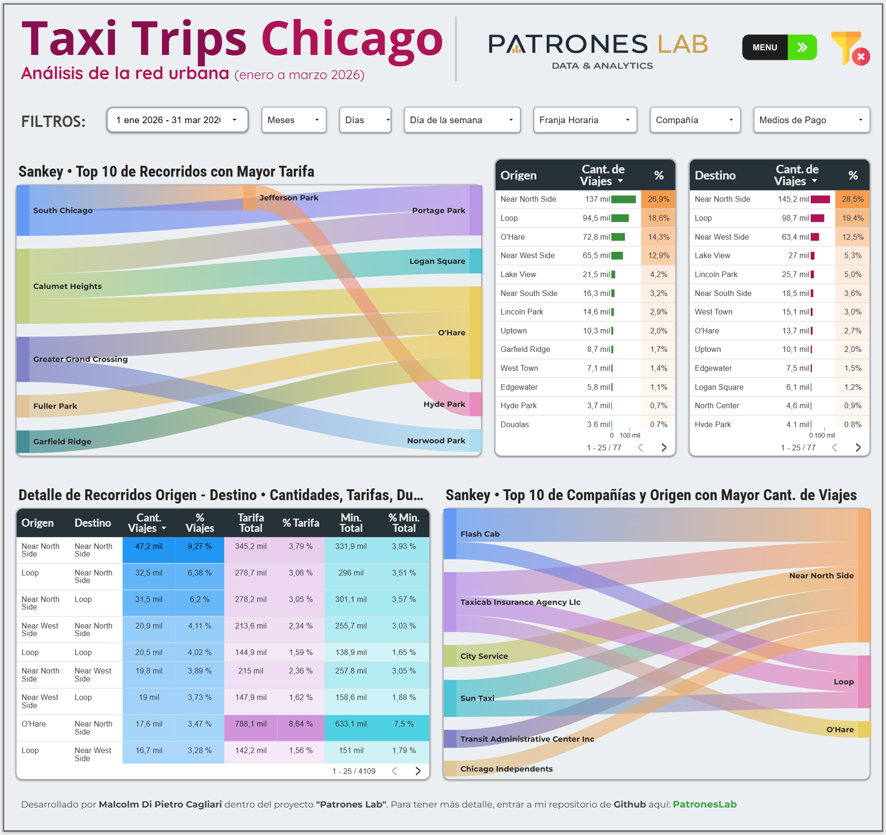
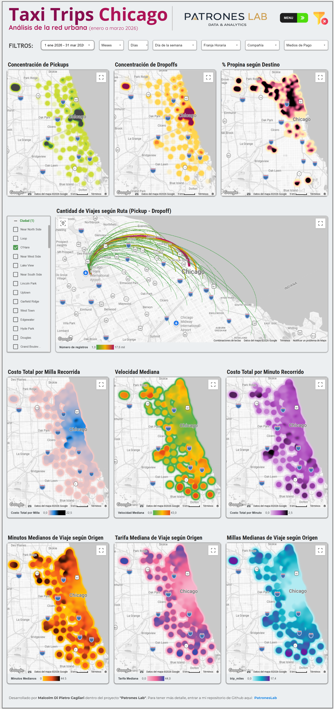

# Taxi Trips Chicago · Dashboard en Looker Studio

Dashboard interactivo desarrollado en **Looker Studio** (Google Data Studio) para analizar viajes de taxi en Chicago a partir de datos públicos, con foco en patrones temporales, comportamiento operativo, recorridos origen-destino y análisis geoespacial. El dataset incluye aproximadamente 508.000 pertenecientes a los meses de enero, febrero y marzo del 2026.

## Dashboard interactivo

### [ENTRAR AL DASHBOARD](https://datastudio.google.com/reporting/b0b32df2-f110-4bac-8dfb-3be359d4888d)

---

## Objetivo del proyecto

Este proyecto busca transformar un dataset transaccional de viajes de taxi en una visualización navegable y útil para análisis exploratorio y entendimiento de los datos.

El dashboard organiza la información en distintas capas:

- **presentación general** del comportamiento del sistema
- **análisis de variables** con foco en distribución y variabilidad
- **detalle de pickups y dropoffs** para entender recorridos y relaciones origen-destino
- **análisis geoespacial** para detectar concentración, intensidad y diferencias territoriales

---

## Estructura del dashboard

El informe está dividido en **4 hojas** más una pantalla inicial de navegación:

### 1. Menú
Pantalla de entrada con navegación a las distintas secciones del dashboard.

### 2. Presentación

Vista ejecutiva con los principales indicadores y visualizaciones del período:

|  |  |  |
|---|---|---|
| cantidad de viajes | recaudación total | tarifa mediana |
| costo mediano | millas promedio | minutos promedio |
| promedio diario de viajes | evolución temporal de viajes y recaudación | distribución de viajes por duración |
| ranking de compañías | participación por día de semana | participación por franja horaria |
| composición por medio de pago |  |  |

### 3. Análisis de variables

Sección centrada en métricas derivadas y su comportamiento horario:

|  |  |
|---|---|
| velocidad mediana y rango entre percentiles | costo total mediano |
| tarifa por minuto | tarifa por milla |

Esta hoja está orientada a leer patrones de nivel y dispersión a lo largo del día.

### 4. Detalle Pickups - Dropoffs

Vista específica de relaciones entre origen y destino:

|  |  |  |
|---|---|---|
| Sankey de recorridos con mayor peso | tablas de detalle origen-destino | vínculo entre compañías y zonas de mayor actividad |

### 5. Análisis geoespacial

Hoja enfocada en la dimensión territorial:

|  |  |
|---|---|
| concentración de pickups | concentración de dropoffs |
| porcentaje de propina según destino | rutas pickup → dropoff |
| mapas por costo, velocidad, duración, tarifa y millas |  |

---

## Contenido analítico

El dashboard permite explorar preguntas como:

- cómo evoluciona la actividad a lo largo del tiempo
- qué franjas horarias concentran más viajes
- cómo cambia la velocidad mediana según la hora
- qué compañías concentran más viajes o recaudación
- qué zonas funcionan como principales orígenes y destinos
- cómo se distribuyen territorialmente variables como tarifa, duración, velocidad y propina

---

## Filtros disponibles

El informe incorpora filtros interactivos para segmentar el análisis por:

- período
- mes
- día
- día de la semana
- franja horaria
- compañía
- medio de pago

---

## Herramientas utilizadas

- **Looker Studio** para visualización y navegación del dashboard
- **CSV** como fuente base de datos
- tablas auxiliares de lookup para enriquecer áreas de pickup y dropoff
- campos calculados para métricas temporales, operativas y geográficas

---

## Capturas del dashboard

### Menú

### Presentación

### Análisis de variables

### Detalle Pickups - Dropoffs

### Análisis geoespacial

---

## Últimos comentarios

> Proyecto desarrollado dentro de **@PatronesLab** — análisis de datos abiertos con foco en entender patrones reales y comunicarlos de forma clara.

**Fuente principal:** City of Chicago Data Portal – Taxi Trips (2024-) --> https://data.cityofchicago.org/Transportation/Taxi-Trips-2024-/ajtu-isnz
